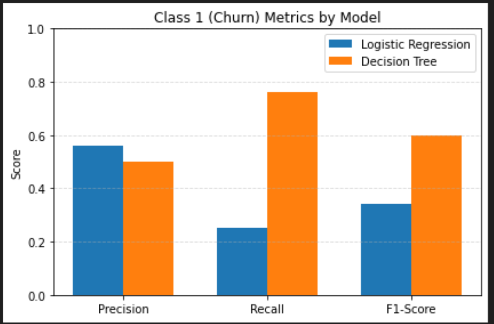

# Customer Churn Prediction for SyriaTel

### Overview

SyriaTel, a leading telecommunications provider, faces the challenge of customer churn—when users stop using their services. High churn negatively impacts revenue and increases customer acquisition costs. To remain competitive, it's essential for SyriaTel to identify customers who are at risk of leaving and take proactive steps to retain them.

## Business Understanding

Customer retention is a critical concern in the highly competitive telecommunications industry. For SyriaTel, losing customers to competitors not only results in immediate revenue loss but also increases the cost of acquiring new users to replace them. Since attracting new customers is often more expensive than retaining existing ones, improving customer loyalty directly enhances profitability and business sustainability.

The primary challenge is that customer churn is not always easy to predict using intuition alone. Customers may leave due to various reasons such as high service costs, poor network quality, dissatisfaction with customer service, or more attractive offers from competitors. These decisions often follow patterns in customer behavior that, if identified early, can allow the company to intervene proactively.

## Stakeholders

1. Customer Retention Team : Identify at-risk customers and implement personalized retention strategies.

2. Marketing Department : Design and execute targeted campaigns to improve customer engagement and satisfaction.

3. Customer Service Team : Improve customer experience by resolving issues early.

4. Product & Network Teams :Improve service quality, features, and coverage to enhance customer satisfaction.

5. Executive Leadership : Monitor churn trends, customer lifetime value, and ROI on retention efforts.

# Data Source
The dataset, `bigml_data.csv`, is a publicly available telecom customer dataset derived from SyriaTel’s internal records. It includes:
- **Customer demographics**
- **Call and service usage patterns**
- **Plan subscriptions (e.g., international, voicemail)**
- **Customer support interactions**
- **Churn status (Yes/No)**

## Data Exploration

### Key Observations:
- The dataset had a **class imbalance**, with significantly more non-churned customers.
- **Categorical features** such as `International plan` and `Voice mail plan` were converted to numerical using **one-hot encoding**.
- **Numerical features** like `Total day minutes`, `Monthly charges`, and `Customer service calls` were **scaled** using `StandardScaler`.
### Visual Insights:
- Customers with **international plans** and frequent **customer service calls** showed higher churn tendencies.
- **Tenure (`Account length`)** alone wasn't strongly predictive of churn.
- A **violin plot** showed overlapping distributions between churn and non-churned customers, indicating the need for multivariate modeling.

## Modeling

### Baseline: Logistic Regression
- Trained on imbalanced data → predicted only majority class (`No Churn`)
- After applying **SMOTE** for oversampling:
- Model performance improved
- ROC-AUC score indicated better class separation
  ### Insights from Logistic Regression Model
High accuracy overall (86%) due to predicting the dominant class (No Churn)

Extremely poor recall for churners (25%) — missed most of the actual churners

Better for interpreting feature impact, but not suitable for practical churn prediction

# Insights from Decision Trees Model
### Decision Tree

Balanced performance with recall of 76% on churners, significantly better than logistic regression

Captured nonlinear relationships and feature interactions (e.g international plan and high service calls)

Slight dip in overall accuracy, but provided much more business value by detecting at-risk customers.

### Conclusion

In this project, we explored multiple classification models to predict customer churn for SyriaTel, a telecommunications company. The goal was to identify customers at risk of leaving and support proactive retention strategies.

 Logistic Regression

High accuracy overall (86%) due to predicting the dominant class (No Churn)

Extremely poor recall for churners (25%) — missed most of the actual churners

Better for interpreting feature impact, but not suitable for practical churn prediction

Decision Tree

Balanced performance with recall of 76% on churners, significantly better than logistic regression

Captured nonlinear relationships and feature interactions (e.g international plan and high service calls)

Slight dip in overall accuracy, but provided much more business value by detecting at-risk customers.

##  Recommendation

Decision Tree is the recommended model for predicting customer churn in this project.
It strikes a strong balance between predictive power and interpretability, making it suitable for operational use by SyriaTel’s retention or customer experience teams.

## Business Impact:
Enables SyriaTel to identify at-risk customers with high confidence and intervene before they churn.

Supports data-driven strategies for customer retention such as proactive offers or targeted service improvements.

Helps the business allocate resources more efficiently by focusing on customers most likely to leave.

